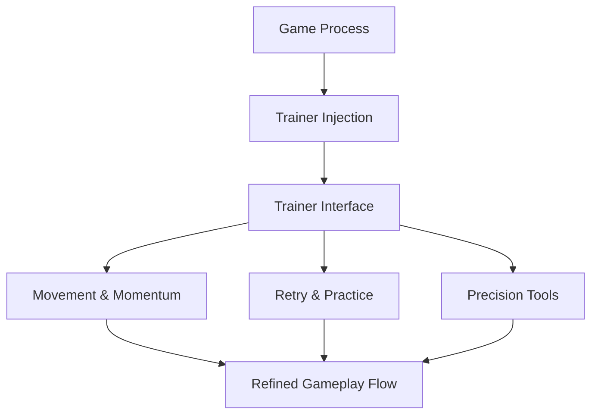

# Megabonk Trainer

Megabonk is a game about *impact*.
About timing that clicks, momentum that sings, and mistakes that echo just long enough to teach you something.

**Megabonk Trainer** doesn’t mute that echo.
It tunes it.

A lightweight control layer for players who want to practice precision, explore physics, and enjoy the rhythm of movement without the friction of constant resets.

---

## 🎛 Overview

This Trainer is a **real-time gameplay adjustment tool** that hooks into Megabonk while it’s running, offering live toggles for stamina, retries, speed, and pacing. Nothing permanent, nothing forced — just options you can reach for when learning curves get steep.

Some runs you chase perfection.
Other runs you *study why it works*.

Both are progress.

---

## 🧰 Trainer Features

### ⚡ Movement & Momentum

* Infinite stamina / energy
* Adjustable movement speed
* Air-control tuning
* Momentum preservation toggle

### 🔁 Retry & Practice Tools

* Instant level restart
* Checkpoint reload
* Fall/fail protection (optional)
* Practice mode without penalties

### 🎯 Precision Helpers

* Slow-motion toggle
* Frame-perfect timing assist
* Camera smoothing adjustments
* Input grace window

### 🧠 Exploration & Comfort

* Free camera (training view)
* UI minimal mode
* Hotkey-only control
* On-the-fly value sliders

[!NOTE]
Every option is modular. Use one tool to learn — not all to skip.

---

## ⚙️ How to Use

1. Launch Megabonk
2. Run the Trainer as administrator
3. Wait for process detection
4. Toggle options via menu or hotkeys
5. Adjust values live during runs

Example “practice loop” setup:

```text
• Slow-motion: On (light)
• Infinite stamina: On
• Fail protection: Off
• Checkpoint reload: Hotkeyed
→ Learn routes without breaking flow
```

[!IMPORTANT]
For first-time playthroughs, avoid fail protection — Megabonk teaches best through honest mistakes.

---

## 🔁 Control Flow



Immediate feedback. Focused control. No interruptions.

---

## ❓ FAQ

**Is this just for skipping hard parts?**
No. It’s built primarily for practice and mastery.

**Will it affect my progress or saves?**
No — all changes exist only while the game is running.

**Can I toggle slow motion mid-jump?**
Yes. Most options apply instantly.

**Is it useful for speedrunning practice?**
Absolutely. Timing and retry tools are ideal for route learning.

**Does it remove challenge entirely?**
Only if you choose that path. Precision remains yours.

---

## 🌘 Final Thoughts

Megabonk is about feel —
the moment when motion and intent align.

This Trainer doesn’t take that moment away.
It helps you *find it more often*.

Slow time.
Try again.
And let mastery arrive through understanding, not exhaustion.

---
